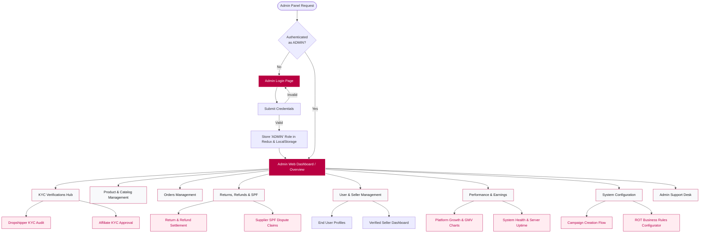

# MShoppy Admin Panel Flow & Access

Here is the flow diagram illustrating the structure of the Admin Panel, including the access points, features, and capabilities it provides to administrators. 

### Access Control
- **Login Requirements**: Admin access requires a specific login via the `/admin/login` route.
- **Credentials**: Uses an email/password combination (e.g. `admin@mshoppy.com` / `admin123` for testing). 
- **Role Validation**: Assigns a generic `ADMIN` role on login, securely stored in local storage and the Redux store (`meesho_admin_token`, `meesho_admin_session`, `admin_user`). All sub-routes require this authentication state.

### Admin Panel Architecture Diagram

